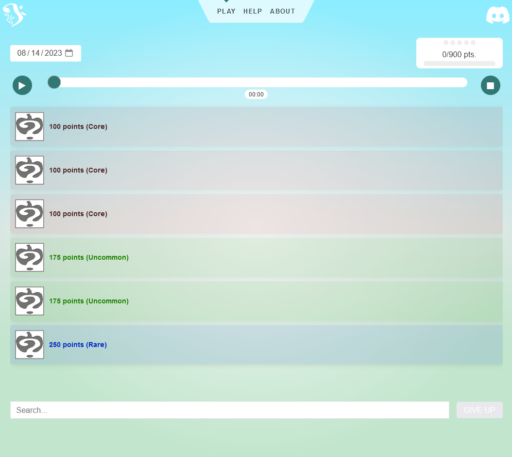

# Motifle: A Homestuck Musical Guessing Game



Motifle challenges players to identify a song's referenced melodies from the vast world of [Homestuck music and fanmusic](https://hsmusic.wiki). Designed to test the knowledge of fans, the game revolves around the many melodies woven into the songs.

## Features

- Players guess a song's referenced melodies.
- Points are awarded based on the rarity of the guessed motif.
- Limited guesses that scale based on the number of motifs in the song.
- Links to the [Homestuck Music Wiki](https://hsmusic.wiki) for each song.

## Getting Started

### Prerequisites

- Ensure you have [Node.js](https://nodejs.org/) installed.

### Installation

1. Clone the repository:
    ```
    git clone https://github.com/recordcrash/homestuck-motifle.git
    ```

2. Navigate into the project directory:
    ```
    cd homestuck-motifle
    ```

3. Install the dependencies:
    ```
    npm install
    ```

4. Start the development server:
    ```
    npm run dev
    ```

## Contributing

Contributions are always welcome! I don't have contribution guidelines, so just get in contact with me via the HS Discord (linked below).

## License

This project is licensed under the MIT License. See the [LICENSE](./LICENSE) file for details.

## Credits

- **Makin**: Main developer and visionary behind the project.
- **quasarNebula and Niklink**: [Homestuck Music Wiki](https://hsmusic.wiki) contributions.
- **Players at the Homestuck Discord**: Valuable feedback on game design and balance.
- **The Homestuck Music Team and fanmusicians**: For their incredible contributions to the music world.

## Support

Love what we're doing? Share the project with your friends and like-minded enthusiasts. If you have feedback or questions, join our conversation on the [Homestuck Discord](https://discord.gg/homestuck)!